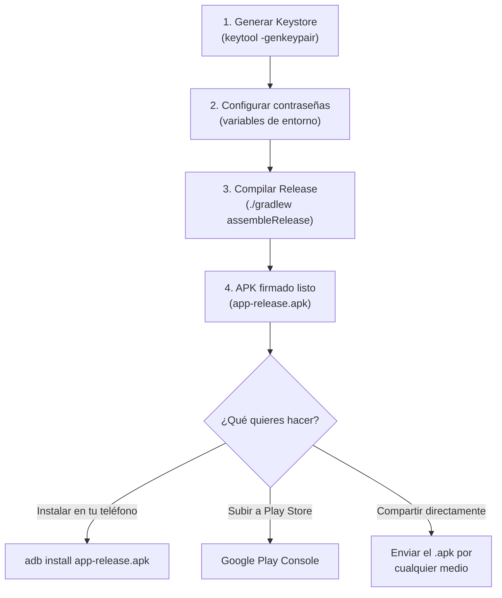

# Firma de APK en Android — Guía Completa

## ¿Qué es la firma de un APK?

Toda app Android **debe estar firmada digitalmente** antes de poder instalarse en un dispositivo. La firma cumple dos propósitos:

1. **Identidad del desarrollador** — Garantiza que el APK fue creado por ti y no fue alterado por un tercero.
2. **Integridad** — Si alguien modifica el APK después de firmarlo, la firma se invalida y Android rechaza la instalación.

## Debug vs Release: ¿Cuál es la diferencia?

| Aspecto | Debug APK | Release APK |
|---|---|---|
| **Firma** | Automática con un keystore genérico (`~/.android/debug.keystore`) | Firmado con **tu propio keystore** personal |
| **¿Se puede subir a Play Store?** | ❌ No | ✅ Sí |
| **¿Se puede instalar en un teléfono?** | ✅ Sí (solo para testing) | ✅ Sí |
| **Optimización** | Sin optimizar | Puede tener ProGuard/R8 (minificación) |
| **Propósito** | Desarrollo y pruebas | Distribución final |

> [!IMPORTANT]
> El APK que compilamos anteriormente es un **debug APK**. Funciona perfectamente para instalar en tu teléfono y probar, pero **no se puede publicar en Google Play Store**.

## ¿Qué es un Keystore?

Un **keystore** (`.jks`) es un archivo protegido con contraseña que contiene tu **clave privada**. Piensa en él como tu "identidad digital" como desarrollador.

> [!CAUTION]
> **NUNCA pierdas tu keystore ni olvides las contraseñas.** Si lo pierdes, no podrás actualizar tu app en Play Store. Google no puede recuperarlo por ti. Guárdalo en un lugar seguro (USB, nube privada, etc.).

---

## Tu proyecto ya está pre-configurado

Tu [build.gradle.kts](file:///home/nov0caina/Documents/VSC_Env/Workspace/buscaminas-_3/app/build.gradle.kts#L26-L34) ya tiene la configuración de firma:

```kotlin
signingConfigs {
    create("release") {
        val keystorePath = System.getenv("KEYSTORE_PATH") ?: "${rootDir}/my-upload-key.jks"
        storeFile = file(keystorePath)
        storePassword = System.getenv("STORE_PASSWORD")
        keyAlias = "upload"
        keyPassword = System.getenv("KEY_PASSWORD")
    }
}
```

Esto significa que el proyecto espera:
- Un archivo keystore en `my-upload-key.jks` (raíz del proyecto) o en la ruta de `KEYSTORE_PATH`
- Contraseña del keystore en la variable `STORE_PASSWORD`
- Contraseña de la clave en la variable `KEY_PASSWORD`
- Un alias de clave llamado `upload`

---

## Paso a Paso: Generar APK Release Firmado

### Paso 1 — Generar el Keystore

Ejecuta este comando en la terminal (elige una contraseña segura cuando te la pida):

```bash
keytool -genkeypair \
  -v \
  -keystore my-upload-key.jks \
  -keyalg RSA \
  -keysize 2048 \
  -validity 10000 \
  -alias upload \
  -storepass TU_CONTRASEÑA_AQUI \
  -keypass TU_CONTRASEÑA_AQUI \
  -dname "CN=Tu Nombre, OU=Dev, O=Tu Empresa, L=Tu Ciudad, ST=Tu Estado, C=MX"
```

> [!TIP]
> - Reemplaza `TU_CONTRASEÑA_AQUI` con una contraseña segura que **no olvides**.
> - Reemplaza los datos de `-dname` con tu información real.
> - `-validity 10000` = la clave será válida por ~27 años.

Esto generará el archivo `my-upload-key.jks` en el directorio del proyecto.

### Paso 2 — Configurar las variables de entorno

Crea o edita el archivo `.env` en la raíz del proyecto para incluir las contraseñas:

```env
STORE_PASSWORD=TU_CONTRASEÑA_AQUI
KEY_PASSWORD=TU_CONTRASEÑA_AQUI
```

> [!WARNING]
> El archivo `.env` **NO debe subirse a Git**. Verifica que `.env` esté listado en tu `.gitignore` (ya lo está en este proyecto ✅).

### Paso 3 — Compilar el APK Release

```bash
ANDROID_HOME=/home/nov0caina/Android/Sdk \
STORE_PASSWORD=TU_CONTRASEÑA_AQUI \
KEY_PASSWORD=TU_CONTRASEÑA_AQUI \
./gradlew assembleRelease --no-daemon
```

### Paso 4 — Encontrar tu APK

El APK firmado se generará en:

```
app/build/outputs/apk/release/app-release.apk
```

### Paso 5 — Verificar la firma (opcional)

```bash
# Ver información de la firma
keytool -printcert -jarfile app/build/outputs/apk/release/app-release.apk

# O con apksigner del SDK
~/Android/Sdk/build-tools/36.0.0/apksigner verify --verbose app/build/outputs/apk/release/app-release.apk
```

---

## Resumen visual del flujo



---

## ¿Quieres que lo haga por ti?

Si me proporcionas la contraseña que deseas usar (o me dices que genere una), puedo:
1. ✅ Generar el keystore automáticamente
2. ✅ Configurar las variables de entorno
3. ✅ Compilar el release APK firmado

Solo dime y lo ejecuto.
